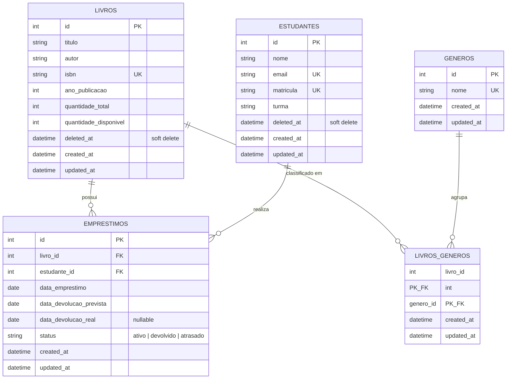

# API REST — Sistema de Biblioteca Escolar (Trabalho 2)

Evolução do Trabalho 1: a mesma API agora é persistida em um **banco de
dados relacional** (SQLite) via **Sequelize** (ORM), com **migrations**
versionadas, **seeds** de demonstração, relacionamentos **1-N** e **N-N**,
e uma **operação transacional** real.

## Sumário

- [Stack e justificativa](#stack-e-justificativa)
- [Modelagem / Diagrama ER](#modelagem--diagrama-er)
- [Instalação e execução (do zero)](#instalação-e-execução-do-zero)
- [Scripts disponíveis](#scripts-disponíveis)
- [Convenções de nomenclatura](#convenções-de-nomenclatura)
- [Migrations](#migrations)
- [Endpoints](#endpoints)
- [Integridade e transações](#integridade-e-transações)
- [Tratamento de erros da persistência](#tratamento-de-erros-da-persistência)
- [Como a equipe se organizou](#como-a-equipe-se-organizou)

## Stack e justificativa

| Camada | Escolha |
|---|---|
| SGBD | **SQLite** |
| ORM | **Sequelize** |

**Por que SQLite em vez de PostgreSQL?** O enunciado aceita SQLite desde
que justificado. Optamos por ele porque o banco é um arquivo local
(`data/dev.sqlite3`) — não é preciso instalar, configurar usuário/senha
nem manter um serviço de banco rodando à parte para reproduzir o projeto.
Isso elimina uma fonte comum de erro de ambiente ao rodar/avaliar o
trabalho em máquinas diferentes. A camada de acesso a dados é isolada nos
`repositories/`, então trocar para PostgreSQL depois é uma mudança
pequena: bastaria (1) ajustar `DB_DIALECT`/`DB_HOST`/etc. no `.env` — a
`config/config.js` já está preparada para isso — e (2) trocar os poucos
tipos específicos de SQLite, se houver algum.

**Por que Sequelize em vez de Prisma?** O Prisma precisa baixar um
binário de engine de um CDN próprio (`binaries.prisma.sh`) durante a
instalação; em ambientes com rede restrita (proxies corporativos,
sandboxes, alguns CI) esse download falha e o Prisma não funciona. O
Sequelize depende só do registro do npm e de um driver do banco (aqui,
`sqlite3`), então é mais robusto para configurar em qualquer máquina —
foi inclusive assim que detectamos o problema, ao tentar rodar com Prisma
neste ambiente. O enunciado permite Sequelize como alternativa.

## Modelagem / Diagrama ER

5 tabelas, com um relacionamento **1-N** duplicado (Livro→Empréstimo e
Estudante→Empréstimo) e um relacionamento **N-N** (Livro↔Gênero, via
tabela de junção `livros_generos`):



**Restrições de integridade aplicadas no esquema:**
- `livros.isbn`, `estudantes.email` e `estudantes.matricula` são `UNIQUE`.
- Todos os campos essenciais são `NOT NULL`.
- `livros.quantidade_total`/`quantidade_disponivel` têm valor padrão `0`;
  `emprestimos.status` tem valor padrão `'ativo'`.
- `emprestimos.livro_id`/`estudante_id` são chaves estrangeiras com
  `onDelete: RESTRICT` — o banco recusa a exclusão física de um livro ou
  estudante referenciado por um empréstimo (a aplicação, por cima disso,
  usa **soft delete**, então essa restrição funciona como uma segunda
  camada de proteção).
- `livros_generos.livro_id`/`genero_id` usam `onDelete: CASCADE` (a
  tabela de junção não faz sentido sem as duas pontas).

## Instalação e execução (do zero)

Pré-requisito: Node.js LTS.

```bash
# 1. Instalar dependências
npm install

# 2. Copiar variáveis de ambiente (o padrão já usa SQLite, nada a configurar)
cp .env.example .env

# 3. Criar as tabelas (roda as migrations)
npm run db:migrate

# 4. Popular com dados de demonstração
npm run db:seed

# 5. Rodar o servidor
npm run dev    # com reload automático
# ou
npm start
```

Servidor em `http://localhost:3000`; documentação Swagger em
`http://localhost:3000/docs`.

### Resetando o banco do zero

```bash
npm run db:reset   # apaga o arquivo sqlite, roda migrate e seed de novo
```

### Rodando os testes automatizados

```bash
npm test
```

Os testes usam **Jest + Supertest** contra um banco SQLite de teste
próprio (`data/test.sqlite3`), recriado do zero (migrate + seed) antes da
suíte rodar — ou seja, os testes também validam que as migrations e o
seed funcionam de ponta a ponta.

## Scripts disponíveis

| Script | O que faz |
|---|---|
| `npm start` | Roda o servidor |
| `npm run dev` | Roda o servidor com reload automático (nodemon) |
| `npm test` | Roda a suíte de testes (Jest + Supertest) |
| `npm run db:migrate` | Aplica as migrations pendentes |
| `npm run db:migrate:undo` | Reverte a última migration |
| `npm run db:seed` | Popula o banco com dados de demonstração |
| `npm run db:reset` | Apaga o banco de desenvolvimento e recria do zero |

## Convenções de nomenclatura

- **Banco de dados**: tabelas e colunas em `snake_case` (`ano_publicacao`,
  `quantidade_disponivel`, `livro_id`), no plural para tabelas.
- **Camada de aplicação (JS/JSON)**: `camelCase` (`anoPublicacao`,
  `quantidadeDisponivel`, `livroId`). O Sequelize (`underscored: true` +
  `field:` em cada atributo) faz essa tradução automaticamente — os
  controllers e a API nunca veem `snake_case`.

## Migrations

Duas migrations, em momentos distintos:

1. **`create-initial-schema`** — cria as 5 tabelas, com PKs, FKs, `UNIQUE`,
   `NOT NULL`, valores padrão e índices para as consultas mais frequentes
   (`titulo`, `turma`, `status`, `estudante_id`, `livro_id`).
2. **`add-soft-delete-to-livros-and-estudantes`** — evolução real do
   esquema: adiciona a coluna `deleted_at` em `livros` e `estudantes`
   (bônus de soft delete) mais os índices correspondentes. Gerada depois
   da primeira, sem editar a migration anterior — exatamente como uma
   mudança de escopo aconteceria num projeto real.

Nenhuma tabela foi criada manualmente; tudo passa por
`sequelize-cli db:migrate`.

## Endpoints

Igual ao Trabalho 1 em formato, mas agora resolvidos no banco. Todos sob
`/api/v1`.

### Livros

| Método | Rota | Observação |
|---|---|---|
| GET | `/livros` | Filtros (`genero`, `titulo`, `autor`, `anoPublicacao`, `ano_min`, `ano_max`), ordenação (`ordenar`, `direcao`) e paginação (`page`, `limit`) — tudo via SQL |
| GET | `/livros/:id` | Inclui a lista de `generos` (JOIN) |
| POST | `/livros` | Transacional: cria o livro e associa os gêneros (criando os que não existirem) |
| PUT | `/livros/:id` | Substitui livro + gêneros |
| PATCH | `/livros/:id` | Atualização parcial |
| DELETE | `/livros/:id` | Soft delete; `409` se houver empréstimo ativo |

### Estudantes

| Método | Rota | Observação |
|---|---|---|
| GET | `/estudantes` | Filtros (`turma`, `nome`), ordenação, paginação |
| GET | `/estudantes/:id` | — |
| GET | `/estudantes/:id/emprestimos` | **Endpoint com dados relacionados**: cada empréstimo já vem com o `livro` (id/título/autor) carregado via `include`, sem N+1 |
| POST / PUT / PATCH / DELETE | `/estudantes[/:id]` | Soft delete no DELETE; `409` se houver empréstimo ativo |

### Empréstimos

| Método | Rota | Observação |
|---|---|---|
| GET | `/emprestimos` | Filtros (`status`, `estudanteId`, `livroId`), ordenação, paginação |
| GET | `/emprestimos/:id` | — |
| POST | `/emprestimos` | **Transacional** (ver seção abaixo) |
| PUT | `/emprestimos/:id` | Substitui |
| PATCH | `/emprestimos/:id` | **Transacional** quando muda `status` para `devolvido` |
| DELETE | `/emprestimos/:id` | **Transacional**: repõe o exemplar se o empréstimo estava ativo |

## Integridade e transações

- **Validação de FK antes de criar**: `POST /emprestimos` verifica se o
  livro e o estudante existem antes de tentar criar o registro,
  retornando `404` com mensagem específica se não existirem.
- **Impedimento de exclusão que quebraria integridade**: `DELETE
  /livros/:id` e `DELETE /estudantes/:id` retornam `409` se houver
  empréstimo ativo vinculado (checagem na aplicação) — e, como segunda
  camada, a própria FK do banco (`onDelete: RESTRICT`) rejeitaria uma
  exclusão física indevida.
- **Operação transacional** (`sequelize.transaction`): criar um
  empréstimo e decrementar `quantidade_disponivel` do livro acontece na
  mesma transação — se qualquer verificação falhar (livro/estudante
  inexistente, sem exemplares disponíveis), **nada** é gravado no banco.
  O mesmo vale para marcar devolução (repõe o exemplar) e para remover um
  empréstimo ativo (idem). Isso é coberto por teste automatizado (ver
  `tests/emprestimos.test.js`, caso "não deve alterar o banco quando não
  há exemplares").

## Tratamento de erros da persistência

Erros do Sequelize nunca vazam para o cliente em formato bruto — são
traduzidos em `src/middlewares/erro.middleware.js`:

| Erro do Sequelize | Resposta HTTP |
|---|---|
| `SequelizeUniqueConstraintError` (ex.: ISBN repetido) | `409 REGISTRO_DUPLICADO` |
| `SequelizeForeignKeyConstraintError` | `409 VIOLACAO_INTEGRIDADE_REFERENCIAL` |
| `SequelizeValidationError` | `400 ENTRADA_INVALIDA` |
| `SequelizeConnectionError` / falha ao conectar | `503 FALHA_DE_CONEXAO` (sem derrubar o servidor) |
| Registro inexistente (checado explicitamente) | `404` |

Formato padronizado, igual ao Trabalho 1:

```json
{ "erro": { "codigo": "LIVRO_NAO_ENCONTRADO", "mensagem": "Livro com id 42 não encontrado" } }
```

## Estrutura do projeto

```
trabalho2/
├── config/
│   └── config.js              # conexão (lê variáveis do .env)
├── migrations/                # 2 migrations versionadas
├── models/                    # Livro, Genero, LivroGenero, Estudante, Emprestimo
├── seeders/                   # dados de demonstração
├── src/
│   ├── routes/
│   ├── controllers/           # enxutos: validam entrada e chamam o repository
│   ├── repositories/          # única camada que fala com o Sequelize
│   ├── schemas/                # validação de entrada (Zod)
│   ├── middlewares/
│   │   ├── erro.middleware.js       # traduz erros do Sequelize -> HTTP
│   │   ├── validacao.middleware.js
│   │   └── asyncHandler.js
│   ├── docs/openapi.yaml
│   └── app.js
├── tests/                     # Jest + Supertest, banco de teste isolado
├── data/                      # bancos SQLite (gerados; fora do versionamento)
├── .sequelizerc
├── .env.example
├── package.json
└── README.md
```

## Como a equipe se organizou

- **Anabela França dos Santos** e **Levy Cálide Pereira** desenvolveram o
  trabalho em conjunto, atuando juntos em todas as etapas: modelagem do
  banco, migrations, seeds, camada de repositórios, adaptação dos
  controllers, tratamento de erros da persistência, operação
  transacional, documentação e testes automatizados.
